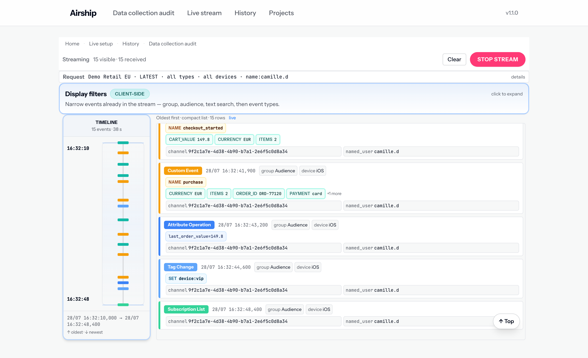

# Airship RTDS Data Collection Audit

**Find out what an app actually tracks.** Point this tool at an Airship project, let it listen to the
real-time data stream, and it hands you the tagging plan: every custom event, attribute, tag, screen
and subscription list the app sends, with counts, platforms and app versions — as a spreadsheet you
can send to a client.

No terminal, no server, no account to create. It runs on your own machine, and the data it reads
never leaves it.

## What you get

- **A tagging plan as `.xlsx`** — one sheet per category, with the values seen for each item. This is
  the deliverable: what is tracked, how often, on which platforms and app versions.
- **The same plan as `.json`** — for anything downstream. The `airship-engagement-review` skill reads
  this file to ground a client engagement review in the client's real taxonomy.
- **The findings that come for free** — an event tracked on iOS but never seen on Android, an
  attribute written by both the SDK and a CRM, a screen name that only exists on an old build.
- **A live stream monitor** — for the other question: did that tap just send what it should have?
  [See below](#watch-a-stream-live).

## Install it

Two double-clicks, on **macOS** or **Windows**. Download the folder with the repository page's green
**Code** button → **Download ZIP**, unzip it, then double-click the launcher inside. It installs
everything it needs, Node.js included, opens your browser on the tool, and keeps itself up to date
from then on. No account and no git required.

**[Full install guide →](docs/INSTALL.md)** — including how to make it always available, so the tool
becomes an icon in your Applications folder rather than something you launch.

## Use it

1. **Projects** — add the client's RTDS token once.
2. **Data collection audit** — pick the project and how the capture should end: on its own once
   nothing new turns up, or when you click Stop.
3. Watch the coverage settle. The four gauges say when the plan is complete enough; the browser tab
   keeps score, so you can leave it running.
4. Download the plan. Every audit is saved and reopenable from **History**.

**[The four steps, in detail →](docs/TUTORIAL.md)**

## Watch a stream live

The other screen answers a different question. Not *what does this app track*, but *did that tap just
send what it was supposed to?*

Pick the project, add the **named user** or **channel ID** of the device you are testing on, and press
Start. Events appear as they reach Airship, with the payload of each one open: the custom event and
its properties, the screen that was viewed, the tag that changed.

The audience filter is the part that matters. Without one, a production project streams every event
from every user at full volume, and finding your own device in that is hopeless. With one, you get a
single tester's journey, in order — which is what the timeline down the left side is.

What people use it for:

- **Checking an integration before it ships.** The event fires, and it carries the properties the
  tagging plan promised it would.
- **Reproducing something a client reported.** Walk the same path on a device and watch what the app
  actually sends, rather than what it is documented to send.
- **Finding the missing step.** A funnel read in order makes the event that never fired obvious.

The filters inside the monitor narrow what is already on screen — by type, by group, by free text —
without restarting the stream, so you can go looking for one thing without losing the rest.

This screen does not produce a tagging plan, and it writes nothing to disk unless you ask. Tick
**Store raw data file** before starting and the session is kept as NDJSON, listed in **History** with
a Download button. Left alone, a live session leaves nothing behind.

## It keeps itself up to date

Nothing to do. It picks up the latest version each time it starts, and while you are using it a
banner offers the update with a single button. The version it is running sits in the top-right corner
and is recorded inside every plan you export, so a file found six months later names the version that
produced it.

## Everything stays on your machine

- Tokens are **encrypted at rest** with a key specific to your machine, in a file that is never
  committed or shared.
- The app answers on **loopback only** (`127.0.0.1`) and requires a local key that only the interface
  on your machine can read. Nothing is exposed to your network.
- Captures are **analysis-only**: events are read as they stream in and never written to disk. Only
  the finished report is saved. Live stream can keep a raw NDJSON if you tick **Store raw data file**.
- The one outbound call is to the Airship RTDS endpoint, with your token.

---

Working on the tool itself? Everything a contributor needs — running it from source, the
architecture, and the constraints behind the launcher — is in **[AGENTS.md](AGENTS.md)**.
