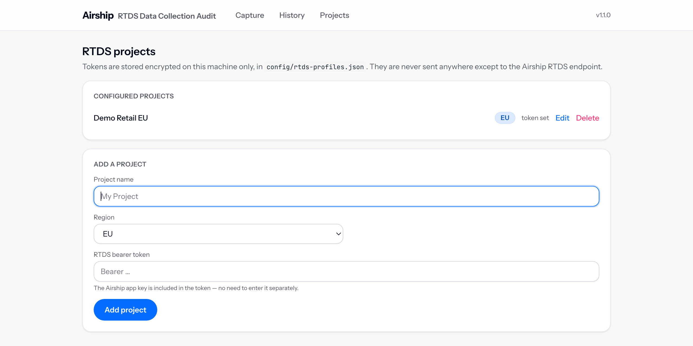
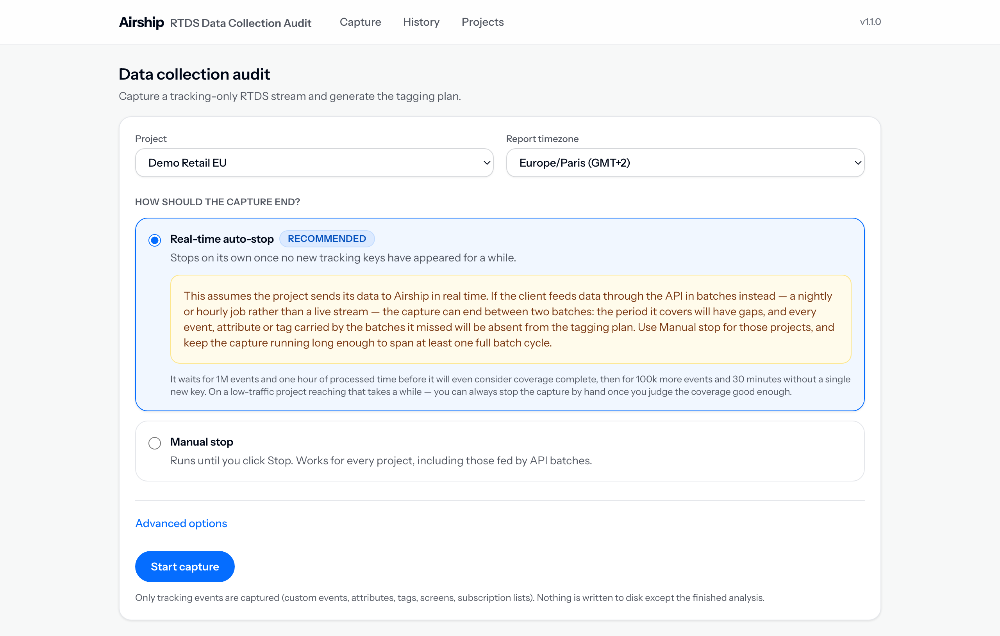
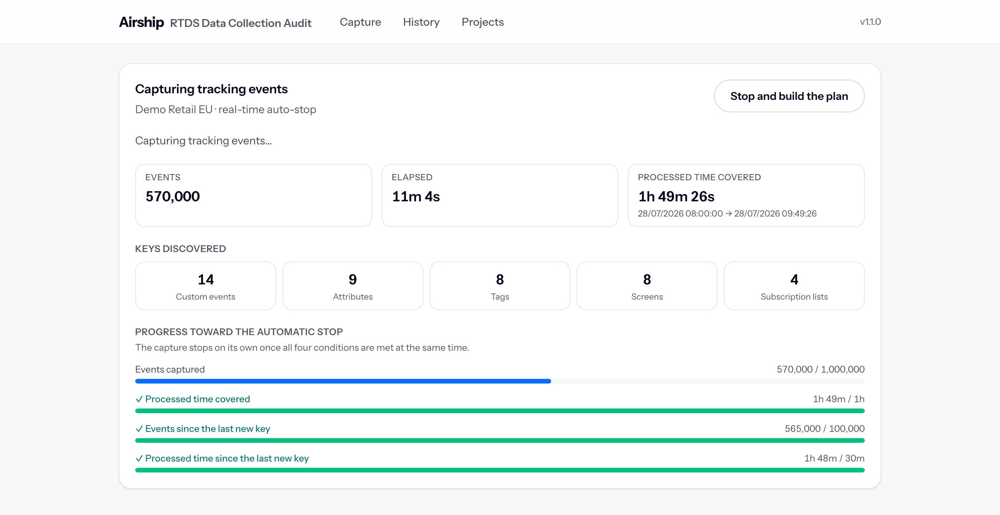
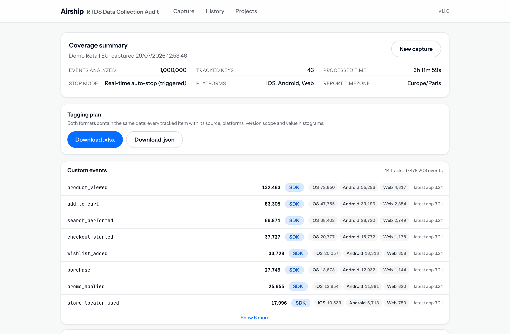

# How to use it

Four steps, from an empty screen to a tagging plan you can hand over. Ten minutes of reading,
most of which you will only need once.

Not installed yet? Start with **[the install guide](INSTALL.md)**, then come back.

> The screenshots show an invented retail app called *Demo Retail EU*. No client data appears
> anywhere in this documentation.

## 1. Add the project, once

Open **Projects** and fill in the form at the bottom.

| Field | What to enter |
|---|---|
| **Project name** | Anything you will recognise later — usually the client name |
| **Region** | `EU` or `US`, matching the Airship project |
| **RTDS bearer token** | The token itself. Pasting the `Bearer ` prefix is fine, and the app key is already inside it |

The token is encrypted with a key belonging to this machine and stored in `config/rtds-profiles.json`,
which never leaves the folder. It is sent to one place only: the Airship RTDS endpoint.

Do this once per client. The projects stay there, and captures reuse them.

## 2. Choose how the capture should end

Open **Capture**, pick the project, and check the report timezone — every date in the report and in
the exports is expressed in it.

Then the one decision that matters:

**Real-time auto-stop** — the default. The capture ends by itself once the stream stops revealing
anything new. It waits for 1 million events *and* one hour of covered time before it will even
consider the coverage complete, then for another 100,000 events and 30 minutes without a single new
event, attribute, tag, screen or list. On a quiet app, reaching that takes a while — you can always
stop by hand once the coverage looks good enough to you.

**One caveat, and it is the reason Manual stop exists.** Auto-stop assumes the app streams to Airship
as things happen. Some clients upload through the API in batches instead — a nightly or hourly job.
For those, the capture can end in the gap between two batches: it looks settled, but everything the
next batch was carrying is missing from the plan. When you know the data arrives in batches, choose
**Manual stop** and let the capture run across at least one full cycle.

**Manual stop** — runs until you click Stop. Always safe, just slower to decide.

Under **Advanced options**, two settings you will rarely touch: the **start position** (replay
everything RTDS still holds, which is the default, or only events from now on) and a **backlog
limit** capping how far back the replay goes.

Then **Start capture**.

## 3. Watch the coverage settle

The top row is how far the capture has got: events read, time spent, and the span of *processed*
time it now covers — that last one, not the elapsed time, is what determines whether a plan is
representative. **Keys discovered** is the plan taking shape, category by category.

The four gauges are the interesting part. They are the questions the auto-stop asks:

| Gauge | What it means |
|---|---|
| **Events captured** | Enough volume for rare events to have had a chance to appear |
| **Processed time covered** | Enough of a time span to cross the app's usage patterns |
| **Events since the last new key** | Nothing new has turned up in a long while |
| **Processed time since the last new key** | And that silence has lasted, in the app's own timeline |

In real-time mode, all four turning green *at the same time* is what ends the capture. In manual mode
nothing stops on its own, but the same four gauges tell you when clicking Stop is a decision rather
than a guess — once they are all met, capturing longer rarely turns up another key.

You do not have to sit and watch. The browser tab keeps score in its title (`● 1.2M events`) and the
favicon carries a blue dot while the capture runs, a green one when the plan is ready, a pink one if
it failed. Just leave the tab open — closing the window ends the capture.

## 4. Take the tagging plan

When the capture ends — on its own or because you stopped it — the coverage summary appears.

The header states what the plan is based on: how many events were analysed, how many distinct keys
came out, the time span covered, how the capture ended, and which platforms were seen. Worth a glance
before you send anything: *Real-time auto-stop (triggered)* means the tool judged the coverage
complete, while a manual stop after fifteen minutes says rather less.

**Download .xlsx** is the deliverable — one sheet per category, plus the value histograms.
**Download .json** is the same content as structured data; it is also the file the
`airship-engagement-review` skill reads to add a data-foundation section to a client engagement
review.

Then read the cards. Each row is one tracked item, and the annotations around it are where the
findings hide:

| On the row | What it tells you |
|---|---|
| The count | How often it was seen during the capture |
| **SDK** / **API** badge | Where it comes from. An attribute arriving from both usually means a CRM writes it as well as the app |
| Platform pills | Per-platform counts — `iOS 72,850`, `Android 55,296` |
| **missing on …** | Tracked on some platforms but never seen on another. Either an implementation gap or something deliberate, but always worth asking about |
| The version scope | The app versions it appeared on. Anything not on the latest build is a candidate for cleanup |

Every capture is saved locally. **History** reopens any of them and regenerates both exports, so you
never need to recapture to produce the file again.

## Good to know

- **Nothing goes anywhere.** The events are analysed as they stream in and never written to disk;
  only the finished report is saved. The tokens and the reports stay in the app folder.
- **A capture cannot be resumed.** If it is interrupted, whatever was captured is lost — start again.
- **The exports are client deliverables.** A tagging plan describes a client's taxonomy in detail;
  treat the files with the same care as anything else you would send them.
- **Something looks wrong?** The [install guide](INSTALL.md#if-something-goes-wrong) ends with a
  troubleshooting table.
