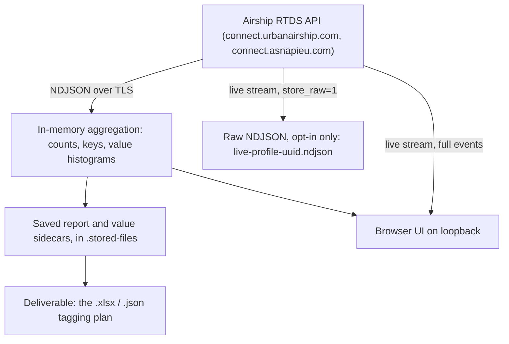

# RTDS Data Collection Audit — Data Protection and Security Brief

| | |
|---|---|
| **Tool** | RTDS Data Collection Audit |
| **Version reviewed** | 1.6.0 as read; the fixes recorded below shipped in 1.6.1 and 1.6.2 |
| **Repository** | `urbanairship/rtds_data_collection` (private) |
| **Commit reviewed** | the import commit on `initial-import` ([PR #1](https://github.com/urbanairship/rtds_data_collection/pull/1)) |
| **Date** | 2026-08-25 |
| **Prepared for** | Privacy & AI Compliance Manager, Legal, Infrastructure & Security |
| **Framework** | Not the BEES AI Compliance Assessment — see *Scope* below |

## Scope, and why the AI framework does not apply

This tool contains no AI. There is no model, no inference, no LLM or ML provider, no prompt
construction and no generated output. Production dependencies are `express`, `cors` and `dotenv` on
the server, and `react`, `react-dom`, `react-router-dom`, `exceljs` and `@tanstack/react-virtual` in
the interface. The analysis engine in [server/src/audit/](../../server/src/audit/) is deterministic:
it counts keys, computes coverage and applies fixed rules.

Running Airship's BEES AI Compliance Assessment against it would return "N/A" for the CIDA system
map and for Sections 2, 3, 4, 6, 8, 9 and 13 — transparency of AI output, agentic guardrails,
model bias, hallucination, model drift, prompt injection and EU AI Act Annex III classification —
and would place the tool in an AI register it does not belong in.

What the tool does have is a substantial **data protection** surface, because it streams a client's
mobile analytics through an employee's laptop, holds RTDS credentials, and produces a deliverable.
That is what this brief assesses.

**Risk signals used:** 🔴 Blocker · 🟡 Action Required · 🟢 Informational.

## Executive summary

**Overall: ready. No blockers.** The tool is well-scoped for what it does: audit captures are
analysis-only by construction, raw retention on live streams is opt-in, the API is bound to loopback
behind a local key, and no client data is ever sent anywhere other than back from Airship.

Signal count: 🔴 0 · 🟡 7 · 🟢 14. **Five of the seven 🟡 items were fixed in the same change as this
brief**, one is knowingly accepted, and the single item still needing an owner outside the code is a
policy decision rather than a defect — see the status column in Section 8.

The finding most likely to be underestimated is not a vulnerability but a data flow: **the exported
tagging plan contains actual values observed in the client's event stream**, not only key names and
counts. If a client writes an email address into a user attribute, that address can reach an `.xlsx`
file that then circulates by email. This is deliberate and useful — showing real values is how a
client validates its taxonomy — and the guides now say so, but whether a values-free export variant
should exist is still open.

What was fixed: **stored captures now expire** after 30 days rather than accumulating on a laptop
indefinitely; **CI now scans dependencies**, which immediately surfaced four live high-severity
advisories including a CSRF bypass in `react-router`, all now patched; the fonts are **self-hosted**,
so the tool no longer contradicts its own "everything stays on your machine" premise on every page
load; and two documentation claims that overstated the protection of RTDS tokens — a
machine-specific key that does not exist, and a ZIP update step that quietly moves the key alongside
the ciphertext — now match what the code does.

## 1. Data map

### What enters

Only five RTDS types are ever requested for an audit — custom events, attribute operations, screen
views, subscription lists and tag changes
([server/src/audit/registry.js:130](../../server/src/audit/registry.js)) — and `trackingOnly` is
forced, not offered as an option
([server/src/controllers/captureController.js:28](../../server/src/controllers/captureController.js)).
`LOCATION` and `REGION` are explicitly excluded. The audit request carries **no audience filters**
([server/src/audit/auditRtdsBody.js](../../server/src/audit/auditRtdsBody.js)), so no individual is
singled out.

Within those events, the fields that can identify a person are the channel ID, the named user ID,
and — depending entirely on what the client chose to send — attribute values, custom event property
values and tag values.

🟢 **Data minimisation is enforced in code, not by convention.** The type list is a constant, the
tracking-only flag cannot be turned off from the UI, and the two location types are excluded.

### What is retained, and where

| Data | In memory | On disk | In the deliverable |
|---|---|---|---|
| Raw NDJSON lines (audit) | transient parse only | **never written** | no |
| Raw NDJSON lines (live) | streamed | only if `store_raw=1` | no |
| Channel / named user IDs | capped sets, 250k | in the event-samples sidecar | no, counts only |
| Attribute and custom property values | histograms, 200 per key | value sidecars | **yes** |
| Tag values | aggregates | in the report | **yes** |
| RTDS token | plaintext per request | encrypted in `config/` | no |

🟢 **Audit captures never write raw event data.** `report.meta.storage.sourceFileName` is a naming
stem, not a file: `analysisOnly: true` and `rawFileKept: false` are set explicitly
([captureController.js:129-130](../../server/src/controllers/captureController.js)).

🟢 **Live raw storage is opt-in and cleaned up when not chosen.** `resolveLiveStoreRaw` defaults to
false ([server/src/rtds/liveStreamReconnect.js:13](../../server/src/rtds/liveStreamReconnect.js)),
and `cleanupLiveStream` deletes the temp file on disconnect unless the user asked to keep it
([server/src/live/streamRegistry.js:29](../../server/src/live/streamRegistry.js)).

## 2. The deliverable contains observed values — 🟡 Action Required

The exported workbook has two sheets built entirely from values seen in the client's stream,
`"Custom Event Values"` and `"Attribute Values"`
([frontend/src/lib/audit/taggingPlanExport.js:1444](../../frontend/src/lib/audit/taggingPlanExport.js)),
and the `Tags` sheet carries each tag's group and value. The `.json` payload carries the same under
`values.attributeValues` and `values.customValues`. Values are truncated at 200 characters
(`VALUE_TRUNCATE`), which limits volume but not sensitivity — an email address or a phone number is
well under 200 characters.

The values come from sidecar files served by `/api/values/*`, themselves written during analysis with
a cap of 200 distinct values per attribute key and per custom property.

This is by design and it is the feature's point. The gap was documentary: both
[docs/INSTALL.md](../INSTALL.md) and [docs/TUTORIAL.md](../TUTORIAL.md) said the exports "describe a
client's taxonomy" and should be treated as a client deliverable — true, but stopping short of saying
the file can carry personal data the client itself put into its taxonomy.

**Fixed here.** Both passages now name the risk and tell the reader to look at the value sheets
before forwarding a plan onwards.

**Still open, and not a decision the code can make:** whether the export should offer a
"taxonomy only, no values" variant for plans that will circulate widely. Adding one is
straightforward; whether it should be the default is a question about how these deliverables are
used. *Owner: tool author, with Privacy.*

🟢 **Event samples hold identifiers.** The `event-samples` sidecar keeps slimmed events including
`device.channel` and `named_user_id`
([server/src/audit/eventSamples.js:14](../../server/src/audit/eventSamples.js)). These are **not**
exported in the tagging plan, but they sit on disk and are readable through `/api/values/*`. Worth
knowing when judging what a laptop holds after a week of audits.

🟢 **Parse-error previews can persist a raw fragment.** Up to eight 400-character previews of
unparseable NDJSON lines are stored in `report.meta.lineErrorSamples`
([server/src/audit/lineErrorPreview.js](../../server/src/audit/lineErrorPreview.js)). A malformed
line is rare, but the preview is verbatim.

## 3. Storage, retention and deletion — 🟡 Action Required

**Originally there was no retention policy, no TTL and no automatic cleanup** — saved reports, value
sidecars, event samples and any kept live NDJSON accumulated in `.stored-files/` until someone
deleted them by hand. The one purge helper in the codebase was never called from anywhere.

**Fixed here.** [server/src/storage/retention.js](../../server/src/storage/retention.js) expires
stored captures after **30 days** by default, configurable through `RTDS_DCA_RETENTION_DAYS`, with
`0` to keep everything. It runs once at startup — no scheduler, for a tool started by hand — and logs
only when it actually removed something. Announced to users in all three guides, so a deletion is
never a surprise, and paired with the reminder that the exported tagging plan is the durable artefact.

Two design choices in it are load-bearing and worth a reviewer's eye:

- **It deletes every file sharing a capture's stem, not the four known suffixes.** Sidecars also
  exist as `.scope-{id}.json` variants, which the per-suffix removal helpers do not reach — a purge
  built on those helpers would have deleted the report and left the client's values on disk beside
  it. The trailing dot in the prefix match keeps `capture-a-b-c` from catching `capture-a-b-c1`, which
  is asserted in a test.
- **An unreadable `RTDS_DCA_RETENTION_DAYS` switches expiry off rather than falling back to 30 days.**
  Deleting a client deliverable because a setting was mistyped is the one outcome worth ruling out,
  so uncertainty means inaction, and a warning says which value was not understood.

Manual deletion was already thorough and remains so: `DELETE /api/history/item` removes the report
and all three sidecar types together
([server/src/controllers/historyController.js:168](../../server/src/controllers/historyController.js)),
and a kept live file is unlinked unless a stream still holds it — a lock the expiry respects too.

**Still open, for Privacy rather than for the code:** whether 30 days is the right window. The
mechanism and its default are in place; the number is a policy call.

🟢 **Storage is owner-only.** `config/` and `.stored-files/` are created at `0700` and secrets written
at `0600` ([server/src/security/secureFs.js](../../server/src/security/secureFs.js)); both are
gitignored, and only `.example` files are tracked.

## 4. Credentials at rest

RTDS tokens are encrypted with **AES-256-GCM**, a 12-byte IV and a 16-byte auth tag, prefixed
`enc:v1:` ([server/src/security/profileSecrets.js:17](../../server/src/security/profileSecrets.js)).
The key is 32 bytes from `crypto.randomBytes`, written to `config/.profiles-key` at `0600` on first
use, or supplied via `RTDS_PROFILES_KEY`.

🟡 **`README.md` overstated this — fixed here.** It said tokens are encrypted "with a key specific to
your machine". There is no machine binding: no KDF, no hostname, no hardware identifier — the key is
a random local file. The module's own comment was the accurate version and says so plainly: this
"protects against casual reading / sharing / backups of the JSON alone, not against a full-disk
compromise." The code was never the problem; the user-facing claim now matches it, and says what the
protection does and does not cover.

🟡 **The documented ZIP update procedure moves the key with the ciphertext — fixed here.**
[docs/INSTALL.md](../INSTALL.md) told ZIP users to "copy your `config/` folder across" when updating.
That folder holds both `rtds-profiles.json` and the `.profiles-key` that decrypts it, so the copy is
a plaintext-equivalent bundle. The instruction is not wrong — it is the only way to keep working
profiles — but it is an instruction to move credentials, and now says so. The same list of "files to
keep to yourself" was also missing `.profiles-key` entirely, which has been added: it is the one file
that turns the encrypted profiles back into tokens.

🟢 Tokens are never logged, never returned by the API (profile responses carry only `name` and
`region`), and legacy cleartext tokens are re-encrypted once at startup by
`migrateProfilesEncryption()`.

## 5. Network exposure

### Inbound

The server binds `127.0.0.1:3011` by default
([server/src/index.js:33](../../server/src/index.js)). CORS defaults to the two local Vite origins.
All `/api` routes sit behind `requireLocalClient`, which enforces a loopback source and a 32-byte
local API key ([server/src/middleware/requireLocalClient.js](../../server/src/middleware/requireLocalClient.js)).

🟢 **Path traversal on the one route that serves a file from disk is guarded and tested.**
`resolveCapturePath` rejects `/`, `\` and `..` then re-checks the resolved path is inside the storage
directory ([server/src/storage/resolveCapturePath.js:13](../../server/src/storage/resolveCapturePath.js)),
live filenames must match a UUID-anchored regex, and
[server/src/controllers/historyLive.test.js:53](../../server/src/controllers/historyLive.test.js)
asserts a traversal attempt returns 400.

🟢 **What the local API key actually protects, stated precisely so it is not over-claimed:** it stops
a web page on another origin from driving the API through the browser. It does **not** isolate the
tool from other processes on the same machine, because `GET /api/bootstrap` hands the key to any
loopback caller, and `/api/health` answers without either check
(`PUBLIC_BOOTSTRAP_PATHS`). The real network control is the loopback bind. That is a reasonable
posture for a single-user local tool; it is worth writing down so nobody assumes more.

### Outbound

| Host | Purpose | Client data sent? |
|---|---|---|
| `connect.urbanairship.com` / `connect.asnapieu.com` | the RTDS stream itself | token and filter JSON out; client events come back |
| `api.github.com` | SDK release dates for the obsolescence check | no |
| `github.com` (git remote) | update fast-forward | no |
| `nodejs.org` | private Node install, SHA-256 verified | no |
| `raw.githubusercontent.com`, `codeload.github.com` | archive updater, currently dormant | no |
| ~~`fonts.googleapis.com`~~ | two web fonts — **removed in this change** | no |

🟢 **No client data leaves the machine for any third party.** Airship is the source of the stream,
not a destination for it. Nothing uploads reports, captures or tagging plans anywhere.

🟡 **Google Fonts contradicted the tool's own premise — fixed here.**
`frontend/src/index.css` opened with an `@import` from `fonts.googleapis.com`, so every page load
told Google that someone had opened the tool, from which IP, and when. For a tool whose README
section is titled "Everything stays on your machine", that was the one line undoing the claim.

The two families are now self-hosted from `@fontsource-variable/*` and bundled into the build, so a
page load contacts nobody and the interface also works with no network at all. All Unicode subsets
ship deliberately, not just Latin: the interface is English, but the values it renders are the
client's, and a Cyrillic or Greek attribute value should not come out as empty boxes. `unicode-range`
means a browser still downloads only the subset it needs.

While correcting this, a related claim in `README.md` was also wrong and is fixed: it said "the one
outbound call is to the Airship RTDS endpoint", which had never accounted for the GitHub calls that
fetch SDK release dates and check for updates. It now lists them.

## 6. Supply chain and persistence on the machine

The updater is the part that can replace the app's own code, so it is the part worth reading closely.

There are two routes, and the weaker one is never used where the stronger exists. A git checkout
fast-forwards only — `--ff-only` proves the new history contains the old one, which is an integrity
check an archive cannot offer — and refuses outright if the working tree is dirty or HEAD is
detached. A folder without git compares published version numbers and replaces its files from a
pinned archive.

**The archive route is currently switched off**, because it is entirely anonymous and this repository
is private (`PUBLISHED_ARCHIVE_AVAILABLE = false` in
[server/src/updates/releaseInfo.js:49](../../server/src/updates/releaseInfo.js)). Its guards remain
in place and tested: strictly-forward version ordering, a protected-path list that refuses to
overwrite `config/`, `.stored-files/`, `.git` or `node_modules`, textual and resolved path-traversal
checks, symlink rejection, a 200 MB cap, two pinned hostnames, and redirects validated per hop rather
than followed.

🟢 **Trust root, stated plainly.** On the git route, an attacker would need write access to the
Airship repository, or the user's git credentials. On the archive route, they would need to serve
content from `raw.githubusercontent.com` or `codeload.github.com` for that repository. Neither route
verifies a code signature; both rest on TLS plus GitHub's own access control.

🟢 **What the tool installs outside its folder**, all reversible and all optional: a launchd agent
that only curls the health endpoint and opens a URL, an ad-hoc-signed `rtds-audit://` handler bundle
in `~/Applications`, and a private Node in `.node/` whose download is SHA-256 verified against the
published checksum file.

🟢 **No shell injection surface.** Every `child_process` call in `server/src` passes an argv array;
there is no `shell: true` and no interpolated command string.

🟡 **CI had no dependency scanning — fixed here, and it found four real vulnerabilities.** The
workflow ran tests and the frontend build only, with no `npm audit`, no Dependabot and no equivalent.
For a tool that is rebuilt from source on other people's machines, a known vulnerability reaching
them unannounced is exactly the failure a repository control should catch. Two pieces now cover it:
a `Dependency audit` job in [.github/workflows/ci.yml](../../.github/workflows/ci.yml), which reads
the lockfiles rather than installing and fails on **high and critical only** — moderate findings in
build tooling would turn a red tick into background noise, and a tick nobody trusts stops being a
control — and [.github/dependabot.yml](../../.github/dependabot.yml), which opens the pull request
that fixes what the job merely reports. Both are needed: nobody watches a red tick on a repository
they visit only to review.

The first run failed, which is the control working. Four high-severity advisories were present in the
frontend and are now patched, the most serious being a **CSRF bypass in `react-router`**
(`GHSA-qwww-vcr4-c8h2`, affecting 7.12.0–7.18.1), alongside denial-of-service advisories in
`brace-expansion` and `nanoid`. All three were fixed within the existing semver ranges — only the
lockfile changed — and the full test suite and the production build pass on the patched tree.

🟡 **One moderate finding is knowingly accepted.** `uuid` below 11.1.1 has a missing buffer bounds
check, reached through `exceljs`, the workbook writer. The only available fix is a **breaking**
downgrade to `exceljs@3.4.0`, which would mean rebuilding the styled tagging plan the tool exists to
produce, against a moderate advisory in a code path this tool does not drive. It sits below the CI
threshold deliberately, and Dependabot will raise it the week a fixed `exceljs` ships.

## 7. Logging

🟢 **Logging is designed around not capturing personal data.** The live controller states the intent
and enforces it: `eventSummary()` deliberately omits channel and named user *even in debug mode*, and
the RTDS request body — which carries audience filters, so named users and channel IDs — is only
logged when `RTDS_DEBUG_LOG=1`, which is off by default
([server/src/controllers/rtdsController.js:14](../../server/src/controllers/rtdsController.js)). The
capture path logs neither.

Logs go to `/tmp/rtds-dca-server.log`, `/tmp/rtds-dca-frontend.log` and `/tmp/rtds-dca.log` and
contain startup banners, reconnect attempts, line counts and error messages.

## 8. Findings and recommended actions

| # | Signal | Finding | Action | Status | Owner |
|---|---|---|---|---|---|
| 1 | 🟡 | Exported `.xlsx` / `.json` contain values observed in the client's stream, which may be personal data | Name the risk in the guides; decide on a taxonomy-only export variant | **Documented; the variant is open** | Author + Privacy |
| 2 | 🟡 | No retention or cleanup for `.stored-files/`; the one purge helper was never called | Expire stored captures on an age threshold, and tell users it happens | **Fixed** — 30 days by default, `RTDS_DCA_RETENTION_DAYS` to change it | Author + Privacy |
| 3 | 🟡 | `README.md` claimed a machine-specific encryption key; there is no machine binding | Match the wording to what the code actually does | **Fixed** | Author |
| 4 | 🟡 | The documented ZIP update step copies `config/`, which holds both ciphertext and key; `.profiles-key` was absent from the "keep to yourself" list | Say the step moves credentials; list the key | **Fixed** | Author |
| 5 | 🟡 | `fonts.googleapis.com` request on every page load, and a README claim of a single outbound call | Self-host the fonts; list the real outbound calls | **Fixed** | Author |
| 6 | 🟡 | CI had no dependency scanning; four high-severity advisories were live, including a CSRF bypass in `react-router` | Add an audit job and Dependabot; patch what is patchable | **Fixed** — job added, four advisories cleared | Author |
| 7 | 🟡 | `uuid` moderate advisory reached through `exceljs`; the only fix is a breaking downgrade of the workbook writer | Accept below the CI threshold; take the Dependabot bump when one ships | **Accepted, tracked** | Author + InfoSec |
| 8 | 🟢 | Event-samples sidecar holds channel and named user IDs on disk | None; recorded for awareness | — | — |
| 9 | 🟢 | Parse-error previews persist up to eight 400-char raw fragments | None; recorded for awareness | — | — |

## 9. Open questions for the reviewers

1. **Is 30 days the right window?** Stored captures now expire on their own, so this is no longer a
   question of whether but of how long. The mechanism and a default are in place; the number is a
   policy call, and changing it is one line in `server/.env`.
2. **Legal basis and the client relationship.** The tool processes the client's end users' personal
   data on Airship equipment. Is that covered by the existing processor terms, or does streaming a
   client's data onto an employee laptop for audit purposes need naming explicitly?
3. **Deliverable classification.** Should a tagging plan containing observed values be handled as
   client-confidential by default, and does that change how it may be shared?
4. **Licence.** The repository declares none. Out of scope for data protection, but it is open in
   [PR #1](https://github.com/urbanairship/rtds_data_collection/pull/1) and needs an owner.

## Method

Findings were established by reading the code, not by inferring from documentation. Every claim above
cites the file it came from. Two areas could not be settled from this repository alone and are stated
as limits rather than conclusions: the full RTDS v3 event schema, so whether a tracking event can
carry an IP address or coordinates as a standard field is not answerable here (the two location types
are excluded from capture regardless); and whether the operating system retains decrypted token
strings in swap or a crash dump.
